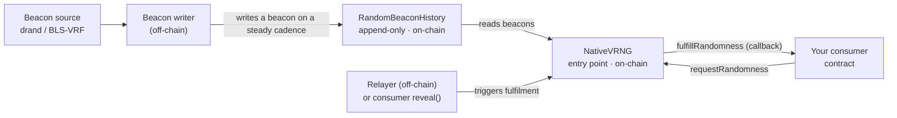

# How it works

A look under the hood: how randomness is produced, how a request is matched to a beacon, and why the result can't be front-run or biased. Integrators don't need this to build — but it's what makes the "verifiable" claim real.

---

## The pieces



*Each node above is described below.*

- **Beacon source → writer.** An off-chain writer continuously produces an unforgeable **BLS-VRF** beacon value — sourced from **drand**, a public distributed-randomness network — and writes it to `RandomBeaconHistory` as a new entry. Beacons are produced on a steady cadence, independent of request traffic.
- **`RandomBeaconHistory`.** An append-only log of beacon entries. Each entry carries a monotonic **`seq`**, the **`beaconValue`**, its **`drandRound`**, and — set **by the contract itself** — the **`writtenAtBlock`** (the L2 block at which it was stored, read from `arbBlockNumber()`).
- **`NativeVRNG`.** The entry point. Records requests, selects the fulfilling beacon, derives the result, and dispatches your callback.
- **Relayer.** An off-chain service that watches for requests and submits the fulfillment transaction. It is a convenience, not a trust anchor — anyone can finalize a commit-reveal request via `reveal`, and the result is identical (path-equivalence).

---

## Matching a request to a beacon (the first-eligible rule)

When you request at block `requestBlock`, the request is fulfillable by the **first non-missed beacon whose `writtenAtBlock` is strictly greater than `requestBlock`**:

```
eligible(beacon) ⇔ beacon.writtenAtBlock > request.requestBlock   (strict)
```

The protocol pins the **canonical first-eligible** beacon for each request and enforces it on-chain (a range check `prevNonMissedWrittenAtBlock <= requestBlock < writtenAtBlock`):

- **It's anchored to block ordering, not wall-clock time.** `writtenAtBlock` comes from the chain's own block number at write time, so it can't be back-dated. (Block *timestamps* are sequencer-controlled and are deliberately **not** used for the security check.)
- **The relayer can't grind.** Because the contract pins the one canonical beacon, a relayer cannot scan future beacons and choose a value that favors a particular outcome.
- **The requester can't predict.** The eligible beacon is written *after* the request block, so its value didn't exist when the request was committed.

## Never stranded

A pending request is **always** eventually fulfillable: as soon as any later beacon is written, an eligible beacon exists. There is no walk-limit, no "missed window", and no terminal *stuck* state — quiet periods just mean a request waits for the next beacon. (Operators can cancel-and-refund a request administratively; that's the only non-fulfillment exit, and it returns the fee.)

## Deriving the result

On fulfillment, `NativeVRNG` computes:

```
randomValue = keccak256(abi.encode(beaconValue, requestId, userRandomness, effectiveSeq, requester))
```

and delivers it to your callback. `effectiveSeq` is the `seq` of the canonical beacon used. Because every input is recorded, the result is fully reproducible — see [Verifying randomness](verifying-randomness.md).

## Path-equivalence

The same request yields the same `randomValue` whether it's fulfilled by the relayer (`fulfillRandomness` path) or finalized by the requester (`reveal` path). Fulfillment is about *delivery*; the value is fixed by the request and its first-eligible beacon.

## Design notes

- **Time/sequence-keyed beacon.** The beacon is keyed by a monotonic sequence + the contract-set write block, not by consumer-supplied block targets. This removes the block-frontier walking and the latency/stranding problems of earlier designs.
- **Batched fulfillment.** Many requests are fulfilled per transaction for throughput, which is why per-request callback gas is bounded ([callback gas](fees-and-limits.md#callback-gas)).
- **Governance.** Protocol parameters and pause are controlled by Gnosis Safes (see [Operations & governance](operations.md)); the contracts hold no privileged backend.

## Next

- [Verifying randomness](verifying-randomness.md) — reproduce and check a result.
- [Contract reference](contract-reference.md) — the `RandomBeaconHistory` surface.
